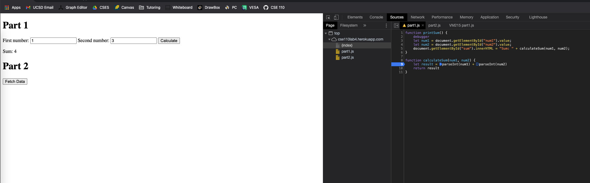

Part 1:
The bug was that the two integers were treated as strings during addition. The fix was to use parseInt() to get the integer values of provided strings before adding.

This is the fixed code:

Part 2:
1. citylots.json
2. part2.js
3. 11.7 MB
4. 1.89 s
5. Mozilla/5.0 (Macintosh; Intel Mac OS X 11_1_0) AppleWebKit/537.36 (KHTML, like Gecko) Chrome/88.0.4324.96 Safari/537.36
6. Apache
7. Tue, 26 Jan 2021 22:14:13 GMT
8. application/json
9. fetchData()
